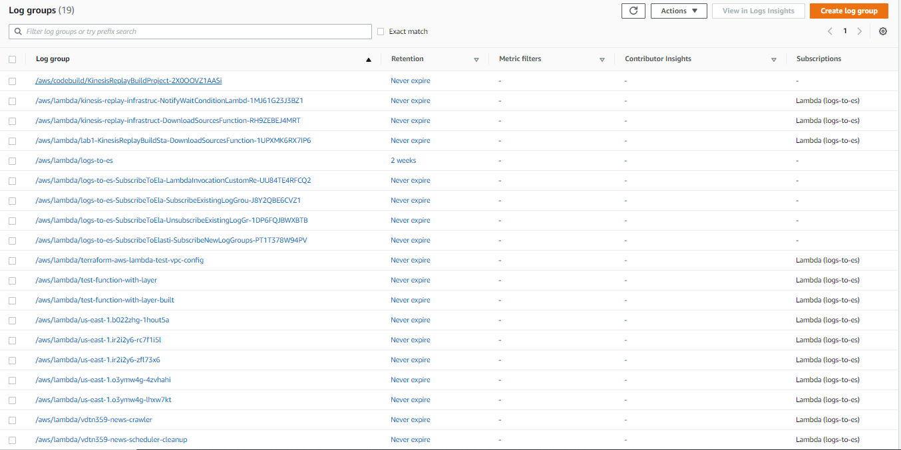

Serverless technologies like AWS Lambda have become increasingly popular these days. A very common use case when developing with Lambda functions is to stream Cloudwatch logs to an external logging service such as Elasticsearch. The Elasticsearch's Kibana plugin can provide a user-friendly interface to explore/search for log messages. 

Based on that requirement, I created this Terraform module:[ aws-lambda-logs-to-es](https://github.com/tuan231195/terraform-modules/tree/master/modules/aws-lambda-logs-to-es) to automate the task. The module utilizes this helpful serverless application [auto-subscribe-log-group-to-arn](https://serverlessrepo.aws.amazon.com/#!/applications/arn:aws:serverlessrepo:us-east-1:374852340823:applications~auto-subscribe-log-group-to-arn) to automatically subscribes all your lambda Cloudwatch logs to a proxy lambda function that will forwards all the logs to an Elasticsearch service endpoint.

Let's see the module in action!

**Requirements:**

* Terraform >= 0.13.0
* A pair of public/private keys (You can generate one by following this [guide](https://docs.github.com/en/github/authenticating-to-github/generating-a-new-ssh-key-and-adding-it-to-the-ssh-agent))

First, we'll need to create a Virtual Private Cloud (VPC) to host your Elasticsearch service. The VPC has 1 public subnet and 1 private subnet.

```hcl
module "vpc" {
	source = "terraform-aws-modules/vpc/aws"

	name = "test-vpc"
	cidr = "10.0.0.0/16"

	azs = [
		"ap-southeast-2a",
		"ap-southeast-2b",
		"ap-southeast-2c"
	]

	private_subnets = [
		"10.0.1.0/24"
	]

	public_subnets = [
		"10.0.101.0/24"
	]

	enable_nat_gateway = false
	enable_vpn_gateway = false
}
```

Next, we will create an Elasticsearch cluster:

```hcl
locals {
	es_domain = "test-es"
}

resource "aws_iam_service_linked_role" "es_linked_role" {
	aws_service_name = "es.amazonaws.com"
}

resource "aws_elasticsearch_domain" "es" {
	depends_on = [
		aws_iam_service_linked_role.es_linked_role]
	domain_name = local.es_domain
	elasticsearch_version = "7.7"

	cluster_config {
		instance_type = "t2.small.elasticsearch"
	}

	vpc_options {
		subnet_ids = [
			module.vpc.private_subnets[0]
		]
		security_group_ids = [
			aws_security_group.es_sg.id
		]
	}

	ebs_options {
		ebs_enabled = true
		volume_size = 10
	}

	access_policies = <<CONFIG
{
  "Version": "2012-10-17",
  "Statement": [
      {
          "Action": "es:*",
          "Principal": "*",
          "Effect": "Allow",
          "Resource": "arn:aws:es:${data.aws_region.current.name}:${data.aws_caller_identity.current
.account_id}:domain/${local.es_domain}/*"
      }
  ]
}
  CONFIG

	tags = {
		Domain = local.es_domain
	}
}
  
resource "aws_security_group" "es_sg" {
	name = "${local.es_domain}-sg"
	description = "Allow inbound traffic to ElasticSearch from VPC CIDR"
	vpc_id = module.vpc.vpc_id

	ingress {
		from_port = 0
		to_port = 0
		protocol = "-1"
		cidr_blocks = [
			module.vpc.vpc_cidr_block
		]
	}
}
```

The Elasticsearch cluster will be private by default. In order to access it in the browser, we will need to create a bastion host in the VPC

```hcl
resource "aws_security_group" "bastion_host_sg" {
	name = "bastion-host-sg"
	vpc_id = module.vpc.vpc_id
	ingress {
		from_port = 22
		to_port = 22
		protocol = "tcp"
		cidr_blocks = [
			"0.0.0.0/0"
		]
	}

	ingress {
		from_port = 80
		to_port = 80
		protocol = "tcp"
		cidr_blocks = [
			local.myip_cidr
		]
	}

	ingress {
		from_port = 9200
		to_port = 9200
		protocol = "tcp"
		cidr_blocks = [
			local.myip_cidr
		]
	}

	egress {
		from_port = 0
		protocol = "-1"
		to_port = 0
		cidr_blocks = [
			"0.0.0.0/0"
		]
	}
}

resource "aws_key_pair" "ec2_key_pair" {
	public_key = file("~/.ssh/id_rsa.pub")
	key_name = "ec2-key"
}

resource "aws_instance" "bastion_host" {
	ami = "ami-01b1940e02781a0fb"
	instance_type = "t2.micro"
	vpc_security_group_ids = [
		aws_security_group.bastion_host_sg.id
	]
	key_name = aws_key_pair.ec2_key_pair.key_name
	associate_public_ip_address = true
	subnet_id = module.vpc.public_subnets[0]
}

resource "null_resource" "sync_nginx" {
	triggers = {
		always = timestamp()
	}

	connection {
		type = "ssh"
		host = aws_instance.bastion_host.public_ip
		user = "ubuntu"
		private_key = file("~/.ssh/id_rsa")
	}

	provisioner "file" {
		destination = "/etc/nginx/conf.d/es.conf"
		content = data.template_file.es.rendered
	}

	provisioner "remote-exec" {
		inline = [
			"sudo nginx -s reload"
		]
	}
}

data "template_file" "es" {
	template = file("${path.module}/config/es.tpl")
	vars = {
		es_endpoint = aws_elasticsearch_domain.es.endpoint
	}
}
```

The bastion host's security group allows access to ports 80 and 9200 only from your IP address.  We will be using an Nginx prebuilt AMI ([packer-nginx](https://github.com/tuan231195/packer-nginx)) to bootstrap the EC2 instance. The EC2 instance uses the key pair that we created earlier so that we can ssh into the instance using our private key. The Nginx config file for configuring Elasticsearch will be generated using the cluster endpoint and copied to the Nginx config dir. 

Let's quickly examine the Nginx config template:

```hcl
server {
    listen 9200;

    location / {
      proxy_pass https://${es_endpoint};
      proxy_redirect off;
      proxy_buffering off;

      proxy_http_version 1.1;
      proxy_set_header Connection "Keep-Alive";
      proxy_set_header Proxy-Connection "Keep-Alive";
    }
}
```

It would allow us to access the Elasticsearch service by navigating to `http://\<ec2 ip\>:9200`

Finally, to the most important part, the lambda that does the streaming:

```
module "logs_to_elasticsearch" {
	source = "git::https://github.com/tuan231195/terraform-modules.git//modules/aws-lambda-logs-to-es?ref=master"
	elasticsearch_service_endpoint = aws_elasticsearch_domain.es.endpoint
	lambda_name = "logs-to-es"
	subnets = [
		module.vpc.private_subnets[0]
	]
	lambda_security_groups = [
		module.vpc.default_security_group_id
	]
}
```

You only need to specify the private subnet, the security group, and also the ES endpoint to create the streaming lambda function.

You can view the full terraform template [here](https://github.com/tuan231195/terraform-modules/tree/master/modules/aws-lambda-logs-to-es/test).

To create the resources:

1. Init the terraform stack `terraform init`
2. Apply to template `terraform apply --auto-approve`

After that, you should be able to check that all your Cloudwatch Logs are now forwarding the streaming Lambda function (logs-to-es)



You can view your Lambda output in Kibana now:


Don't forget to destroy the Terraform stack with `terraform destroy --auto-approve`

**Happy coding!**
